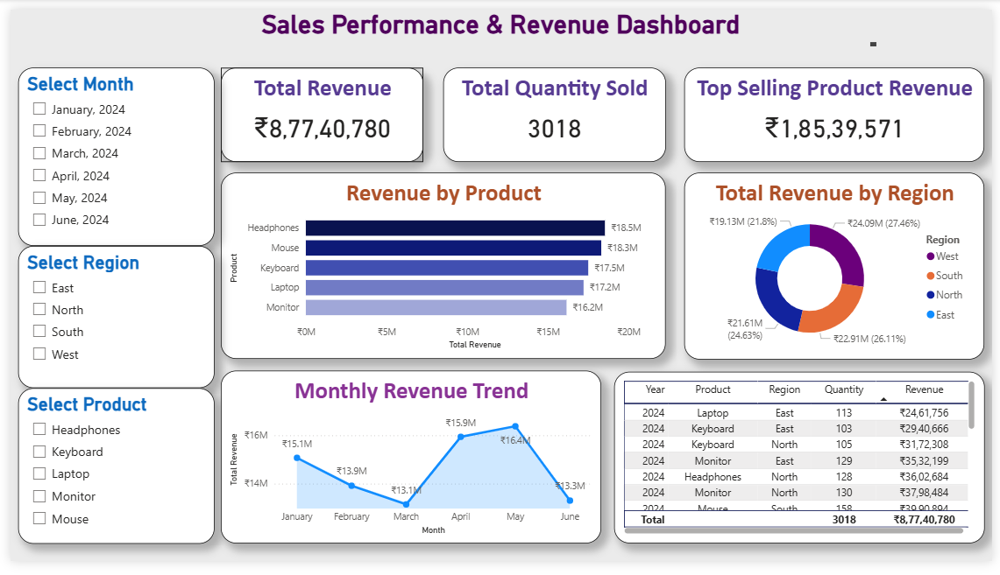

# Sales Data Analysis & Dashboard

## Project Overview
This project focuses on analyzing sales data using Python and visualizing insights using Power BI.

## Tools & Technologies
- Python (Pandas)
- Excel
- Power BI

## What I Did
- Analyzed sales data using Python to calculate revenue
- Created additional columns like Revenue and Month
- Exported cleaned data to Excel
- Built an interactive Power BI dashboard to analyze sales performance

## Dashboard Preview

## Key Insights
- Identified top-selling products
- Analyzed region-wise and monthly sales trends
- Used filters to enable interactive analysis
